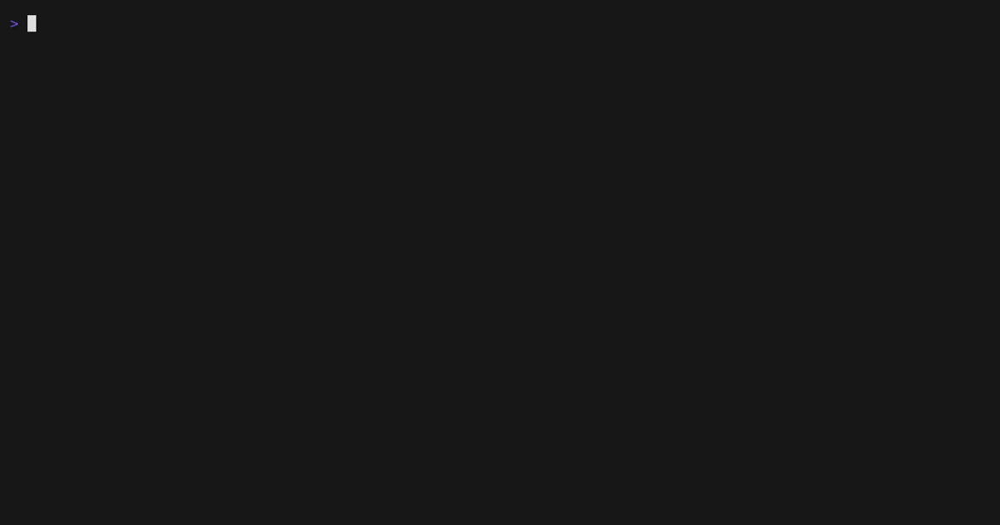

# Reading specs

specgetty has three navigation levels and reads a spec as the structure it
already has, rather than as the markdown it is stored in.

- [The levels](#the-levels)
- [Keys in a spec](#keys-in-a-spec)
- [The keywords a spec is written in](#the-keywords-a-spec-is-written-in)
- [Keys in a change's specs](#keys-in-a-changes-specs)
- [When a spec opens as a report instead](#when-a-spec-opens-as-a-report-instead)

## The levels

There are three levels, and the project picker opens over any of them. Which
second level `enter` reaches depends on the tab you are standing on.

```
   [ project picker ]   p opens it, esc closes it
           |            enter switches project
           v
   project view         the startup view; esc does nothing here
       | enter          tabs: changes | specs | properties
       |
       +--> change view       from the changes tab
       |      |               artifact sub-tabs: proposal | design | tasks | specs
       |      +--> change spec view    from that change's specs sub-tab
       |                               its deltas, marked with what they do
       +--> spec view         from the specs tab
                              an outline beside one requirement or scenario
```

Active and archived changes are shown together in one list, grouped, with the
active group first. There is no separate archive tab and no filter to choose
between them.

## Keys in a spec

A spec opens as an outline of its requirements and scenarios beside a card
showing whichever one the cursor is on. The card is the spec rewritten for
reading: one requirement or one scenario at a time, clauses laid out with their
keyword above the text, rather than the raw markdown.

| Key                        | Action                                             |
|:---------------------------|:---------------------------------------------------|
| `<tab>`                    | Move the keyboard between the outline and the card |
| `j`/`k` or `<up>`/`<down>` | Move one node, or scroll the card                  |
| `^f`/`^b`                  | Page the outline, or the card                      |
| `^d`/`^u`                  | Half a page                                        |
| `gg` / `G`                 | First and last                                     |
| `<esc>`                    | Back to the specs tab, same spec selected          |

A label too long for the outline wraps rather than being cut, and the cursor
still moves one requirement or scenario per keystroke however many rows it
occupies. The cursor stays on the same node across a rescan, so editing the
file above it does not move it.

A scenario's content is shown whatever shape it is written in. Clauses written
as the OpenSpec template shows them get their keyword on a row of its own;
anything else is shown as the prose it is, in the place it was written. Nothing
is left out.

## The keywords a spec is written in

A spec is written in a small vocabulary, and specgetty draws it wherever
markdown is rendered: the specs tab, the detail card, a change's spec deltas,
and the proposal and design documents.

| word                                     | role                            |
| ---------------------------------------- | ------------------------------- |
| `GIVEN`, `WHEN`                          | opens a condition               |
| `THEN`                                   | opens the assertion             |
| `AND`                                    | continues the clause above it   |
| `SHALL`, `SHALL NOT`, `MUST`, `MUST NOT` | binds                           |

The three clause roles are drawn apart from one another, so the shape of a
scenario reads before the words do. The four words that bind are drawn wherever
they appear in a sentence.

The vocabulary is [openspec.nvim](https://github.com/speclib/openspec.nvim)'s,
whose `spec-highlighting` capability gives the same words capture groups for an
editor, so a spec reads the same in either tool. Two consequences of following
it:

- `SHOULD`, `MAY`, `REQUIRED`, `RECOMMENDED` and `OPTIONAL` are not drawn.
  OpenSpec's own guidance is to use `SHALL` and `MUST` and avoid the rest, and
  drawing a word the format discourages would read as endorsement.
- A clause keyword counts only at the start of a line, with or without a list
  marker and with or without bold marks. In the middle of a sentence these are
  ordinary words.

Keywords are matched in upper case only, and never inside a span between
backticks, so a spec that names `SHALL` as a word rather than using one reads as
what it is.



## Keys in a change's specs

A change carries a spec delta per capability it touches, and the specs sub-tab
lists them all as one document. `enter` opens them as an outline instead, marked
with what the change does to each requirement:

| Mark       | On a requirement       | On a scenario                       |
|:-----------|:-----------------------|:------------------------------------|
| `+`        | the change adds it     | the change introduces it            |
| `~`        | the change modifies it | the change edits it                 |
| `-`        | the change removes it  | never: a delta cannot drop one      |
|            |                        | unchanged, and drawn back to say so |

The marks on scenarios are the useful half. A modified requirement is restated
in full even to change one sentence, and more than half of what it restates is
usually text it does not touch. The outline says which half is which without
your reading it.

| Key                | Action                                                |
|:-------------------|:------------------------------------------------------|
| `<left>`/`<right>` | Move between the difference, the original and the new |
| `<esc>`            | Back to the change, specs sub-tab selected            |

Everything else is the same as a spec: `tab`, `j`/`k`, the paging keys and `E`
all behave as they do one level across.

The three-way choice appears only where there is something to compare, which is
a requirement the change modifies and the scenarios inside it. The difference is
what opens, and each node opens on its own difference rather than keeping the
last choice.

Only a change that has not been archived offers it. An archived change's deltas
have already been applied to the project's specs, so those specs are the result
rather than the original, and presenting them as the text the change modified
would be a lie. Such a change shows what it proposed and nothing beside it.

## When a spec opens as a report instead

`enter` always descends. If the file cannot be read as a spec, the view says why
instead of showing an outline:

```
 +--------------------------------------------------------------+
 |                                                              |
 |    specgetty cannot read airplane-mode as a spec             |
 |                                                              |
 |    These are the rules openspec itself reads a spec by, so   |
 |    validate, list and archive cannot see this file either.   |
 |                                                              |
 |    There is no ## Purpose section. Every spec needs one.     |
 |                                                              |
 |    line 3                                                    |
 |    ## ADDED Requirements is a delta header. It belongs in    |
 |    a change, under openspec/changes/<name>/specs/. A main    |
 |    spec keeps its requirements under ## Requirements...      |
 |                                                              |
 +--------------------------------------------------------------+
  esc back to specs   E edit   jk scroll
```

Every reason is listed, with the line it sits on. `E` opens the file in your
editor, and `esc` returns to the specs tab where the whole file is readable as
markdown. Fix the file and the next scan turns the report into an outline
without you leaving the view.

The rules are OpenSpec's own, transcribed from its parser rather than invented
here, so a file specgetty will not structure is one `openspec validate` also
rejects:

| rule                                                  | why it matters                    |
|:------------------------------------------------------|:----------------------------------|
| requirements live under one `## Requirements` heading | openspec parses only that section |
| a `## Purpose` section                                | required of every spec            |
| `### Requirement: <name>` inside that section         | outside it, it is invisible       |
| a `#### ` heading with content under it               | that is a scenario                |
| no `## ADDED Requirements` and the like               | delta headers belong in a change  |

What OpenSpec does not define is how a scenario's content is written. Its own
model for a scenario is raw text, so specgetty accepts whatever is there rather
than requiring a convention no tool enforces.
